```r
library(Norimon)
suppressPackageStartupMessages(library(tidyverse))
library(ggplot2)
suppressPackageStartupMessages(library(kableExtra))
library(tmap)
library(sf)
library(DBI)
```


# Introduction
The Norimon package is a collection of analysis functions for working with the data from the national insect monitoring program in Norway. I will here introduce some functions that can be used to produce insect indicators from this package. Their use isn't limited to indicators, essentially they are meant to be of general use, for fetching and plotting quantities from the insect monitoring program.

Note that this functionality is still under development. More functions will be added, and there is need for some bugfixes and changes.

# Workflow for indicators
These functions are built upon a general idea of how to produce indicators. Although there might be a need for other types of indicators that require a completely different toolchain, this method is meant to capture a broad variety of insect indicators.

**Main steps of workflow:**

1. Fetch observations of biomass or specific species or higher taxa from a centralized database (or GBIF)
2. Bootstrap observations and calculate mean and uncertainty of point estimate
3. Compare observations to a reference point
4. Display and plot the results

Most of the ecology comes into step 1, in choosing what data to use to describe a quality. This can be a custom selection of species, or a set of higher taxa such as specific genuses, families or an order. The goal is to choose a set of taxa that represent specific qualities of the community that can indicate the ecological status of the ecosystem. In addition to the selection of taxa, we have to decide on the level of aggregation, e.g. if we should aggregate the data on the region scale, locality scale, or even the individual sample occasion scale.

The second step is used to get an estimate of the uncertainty of the data. This routine is in principle flexible, as we could bootstrap the samples on different sampling levels (samples within localities, regions within country). Typically, we will work on the year locality scale, meaning that we fetch summary data on the observations from a location throughout a whole season. These data will typically be bootstrapped and summarized to regional values, for example expressing the mean values with uncertainty insect biomass in Trøndelag in 2021.

Ecological knowledge also comes into step 3, comparing the values to a reference state. Here we have several options. We could for example use a single defined value as the reference state. But we can also use a point in time as a reference point (e.g. the start of a time series).

Put together, this framework is meant to facilitate the calculation of a broad set of insect indicators, based on the combination of choices in data to fetch, aggregation level, and reference comparison.

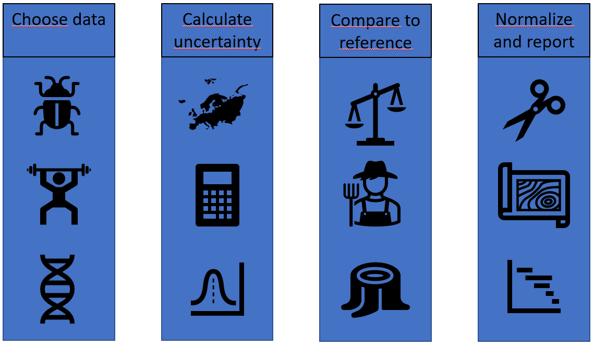


# Showcase of functionality

## Fetching observations
The most convenient method is to fetch the data directly from the main database that hold all data from the national insect monitoring program. This is located in-house at NINA, and while this might change in the future, it cannot at the moment be reached from the outside. For those who this option isn't available, we will build additional functions that first downloads the public GBIF records of the data, so that we can work with a local copy. At the moment, only the in-house database methods is implemented.

### Accessing the database
The database is a standard PostgreSQL/PostGIS database which can be accessed through standard R tools, e.f. with the `DBI` and `RPostgres` packages. However, it is convenient to use the custom function `connect_to_insect_db()`. This function will create a connection called 'con', that later functions will use to fetch the data.


```r
connect_to_insect_db()
```

You should never store your passwords in a script file! This makes working with database connections in documentation a little bit tricky. What I tend to do is to store my username and password in a text file in my home folder that only my user can read, and fetch this password temporarily in scripts. The connect function uses the variable names 'username' and 'passwords' in the global environment if they exist. In this case, I have the username and password stored in the file .rpgpass in my home folder. Therefore, I can connect like this.


```r
connect_to_insect_db()
```

To set this up for yourself, store your username and passwords in a file and adjust the permissions so that only you can read it. On linux, put it in a hidden file (with a leading dot, such as .rpgpass) in your home folder, and set the permissions to read only for the owner (e.g. chmod 600 ~/.rpgpass). After that, you can simply use the above connection method securely.

### Fetch observation data
We have two main types of insect data in the database, insect observations and insect weights. These data can be fetched by the functions `get_observations` and `get_biomass`, respectively.

The observations can be subsetted on taxonomy, at different taxonomic levels. You can also aggregate the data on various observational levels. The default aggregation level is 'year_locality' which gives you all records for each locality, summarized over the whole year. For example, to get all beetle records aggregated at the 'year_locality'-level, you do:


```r
beetles <- get_observations(subset_orders = "Coleoptera")
```
This function provides both the number of species, the shannon diversity, and the mean intraspecific variation per species (the mean number of unique ASV's per species). Note that currently, we don't have ASV-data for the 2020 dataset, i.e. we get a mean_asv_per_species of 1 for all these records. Here only the first 5 rows are shown.

<table>
 <thead>
  <tr>
   <th style="text-align:right;"> year </th>
   <th style="text-align:left;"> locality </th>
   <th style="text-align:left;"> habitat_type </th>
   <th style="text-align:left;"> region_name </th>
   <th style="text-align:right;"> no_species </th>
   <th style="text-align:right;"> shannon_div </th>
   <th style="text-align:right;"> mean_asv_per_species </th>
  </tr>
 </thead>
<tbody>
  <tr>
   <td style="text-align:right;"> 2020 </td>
   <td style="text-align:left;"> Skog_01 </td>
   <td style="text-align:left;"> Forest </td>
   <td style="text-align:left;"> Østlandet </td>
   <td style="text-align:right;"> 83 </td>
   <td style="text-align:right;"> 4.42 </td>
   <td style="text-align:right;"> 1 </td>
  </tr>
  <tr>
   <td style="text-align:right;"> 2020 </td>
   <td style="text-align:left;"> Skog_02 </td>
   <td style="text-align:left;"> Forest </td>
   <td style="text-align:left;"> Østlandet </td>
   <td style="text-align:right;"> 123 </td>
   <td style="text-align:right;"> 4.81 </td>
   <td style="text-align:right;"> 1 </td>
  </tr>
  <tr>
   <td style="text-align:right;"> 2020 </td>
   <td style="text-align:left;"> Skog_03 </td>
   <td style="text-align:left;"> Forest </td>
   <td style="text-align:left;"> Østlandet </td>
   <td style="text-align:right;"> 83 </td>
   <td style="text-align:right;"> 4.42 </td>
   <td style="text-align:right;"> 1 </td>
  </tr>
  <tr>
   <td style="text-align:right;"> 2020 </td>
   <td style="text-align:left;"> Skog_04 </td>
   <td style="text-align:left;"> Forest </td>
   <td style="text-align:left;"> Østlandet </td>
   <td style="text-align:right;"> 26 </td>
   <td style="text-align:right;"> 3.26 </td>
   <td style="text-align:right;"> 1 </td>
  </tr>
  <tr>
   <td style="text-align:right;"> 2020 </td>
   <td style="text-align:left;"> Skog_05 </td>
   <td style="text-align:left;"> Forest </td>
   <td style="text-align:left;"> Østlandet </td>
   <td style="text-align:right;"> 30 </td>
   <td style="text-align:right;"> 3.40 </td>
   <td style="text-align:right;"> 1 </td>
  </tr>
</tbody>
</table>

The `get_observations` function have several methods for subsetting the data, see the help file for details. As a second example, we take pollinators, defined as a set of families, fetch their observations, and aggregate them to the region_habitat_year level.

For convenience, the pollinator families can be retreived by the `get_pollinators()` function.


```r
pollinators <- get_pollinators()
```


<table>
 <thead>
  <tr>
   <th style="text-align:left;"> family_norwegian </th>
   <th style="text-align:left;"> family_latin </th>
  </tr>
 </thead>
<tbody>
  <tr>
   <td style="text-align:left;"> Gravebier </td>
   <td style="text-align:left;"> Andrenidae </td>
  </tr>
  <tr>
   <td style="text-align:left;"> Langtungbebier </td>
   <td style="text-align:left;"> Apidae </td>
  </tr>
  <tr>
   <td style="text-align:left;"> Korttungebier </td>
   <td style="text-align:left;"> Colletidae </td>
  </tr>
  <tr>
   <td style="text-align:left;"> Markbier </td>
   <td style="text-align:left;"> Halictidae </td>
  </tr>
  <tr>
   <td style="text-align:left;"> Buksamlerbier </td>
   <td style="text-align:left;"> Megachilidae </td>
  </tr>
  <tr>
   <td style="text-align:left;"> Blomsterbier </td>
   <td style="text-align:left;"> Melittidae </td>
  </tr>
  <tr>
   <td style="text-align:left;"> Blomfluer </td>
   <td style="text-align:left;"> Syrphidae </td>
  </tr>
  <tr>
   <td style="text-align:left;"> Smygere </td>
   <td style="text-align:left;"> Hesperiidae </td>
  </tr>
  <tr>
   <td style="text-align:left;"> Glansvinger </td>
   <td style="text-align:left;"> Lycaenidae </td>
  </tr>
  <tr>
   <td style="text-align:left;"> Nymfevinger </td>
   <td style="text-align:left;"> Nymphalidae </td>
  </tr>
  <tr>
   <td style="text-align:left;"> Svalestjerter </td>
   <td style="text-align:left;"> Papilionidae </td>
  </tr>
  <tr>
   <td style="text-align:left;"> Hvitvinger </td>
   <td style="text-align:left;"> Pieridae </td>
  </tr>
  <tr>
   <td style="text-align:left;"> Metallmerker (uoffisiell) </td>
   <td style="text-align:left;"> Riodinidae </td>
  </tr>
</tbody>
</table>


```r
pollinators_fam <- pollinators %>%
  select(family_latin) %>%
  pull()

pollinators_fam
#>  [1] "Andrenidae"   "Apidae"       "Colletidae"   "Halictidae"   "Megachilidae"
#>  [6] "Melittidae"   "Syrphidae"    "Hesperiidae"  "Lycaenidae"   "Nymphalidae" 
#> [11] "Papilionidae" "Pieridae"     "Riodinidae"

poll_region_habitat_year <- get_observations(subset_families = pollinators_fam,
                                      agg_level = "region_habitat_year"
                                      )
```
<table>
 <thead>
  <tr>
   <th style="text-align:left;"> year </th>
   <th style="text-align:left;"> habitat_type </th>
   <th style="text-align:left;"> region_name </th>
   <th style="text-align:right;"> no_species </th>
   <th style="text-align:right;"> shannon_div </th>
   <th style="text-align:right;"> mean_asv_per_species </th>
  </tr>
 </thead>
<tbody>
  <tr>
   <td style="text-align:left;"> 2020 </td>
   <td style="text-align:left;"> Forest </td>
   <td style="text-align:left;"> Østlandet </td>
   <td style="text-align:right;"> 160 </td>
   <td style="text-align:right;"> 5.08 </td>
   <td style="text-align:right;"> 1.00 </td>
  </tr>
  <tr>
   <td style="text-align:left;"> 2020 </td>
   <td style="text-align:left;"> Semi-nat </td>
   <td style="text-align:left;"> Østlandet </td>
   <td style="text-align:right;"> 221 </td>
   <td style="text-align:right;"> 5.40 </td>
   <td style="text-align:right;"> 1.00 </td>
  </tr>
  <tr>
   <td style="text-align:left;"> 2021 </td>
   <td style="text-align:left;"> Forest </td>
   <td style="text-align:left;"> Østlandet </td>
   <td style="text-align:right;"> 149 </td>
   <td style="text-align:right;"> 5.00 </td>
   <td style="text-align:right;"> 2.27 </td>
  </tr>
  <tr>
   <td style="text-align:left;"> 2021 </td>
   <td style="text-align:left;"> Semi-nat </td>
   <td style="text-align:left;"> Østlandet </td>
   <td style="text-align:right;"> 173 </td>
   <td style="text-align:right;"> 5.15 </td>
   <td style="text-align:right;"> 4.20 </td>
  </tr>
  <tr>
   <td style="text-align:left;"> 2021 </td>
   <td style="text-align:left;"> Semi-nat </td>
   <td style="text-align:left;"> Trøndelag </td>
   <td style="text-align:right;"> 129 </td>
   <td style="text-align:right;"> 4.86 </td>
   <td style="text-align:right;"> 2.95 </td>
  </tr>
</tbody>
</table>


### Weight data
Fetching weight data works similarly to observation data, without the possibility of subsetting on taxonomy, since we only weigh the total catch. Typically, it's best to only use the weights from the malaisetraps, which is the default, but you can use all or only the window traps as well. The catches in the window traps are so small, that they probably are unreliable. Here we show the first 5 rows of the results.


```r
year_locality_weights <- get_biomass(trap_type = "MF",
                                         agg_level = "year_locality")
```

<table class="table" style="margin-left: auto; margin-right: auto;">
 <thead>
  <tr>
   <th style="text-align:right;"> year </th>
   <th style="text-align:left;"> locality </th>
   <th style="text-align:left;"> habitat_type </th>
   <th style="text-align:left;"> region_name </th>
   <th style="text-align:right;"> sum_wet_weight </th>
   <th style="text-align:right;"> avg_wet_weight </th>
  </tr>
 </thead>
<tbody>
  <tr>
   <td style="text-align:right;"> 2020 </td>
   <td style="text-align:left;"> Skog_01 </td>
   <td style="text-align:left;"> Forest </td>
   <td style="text-align:left;"> Østlandet </td>
   <td style="text-align:right;"> 93.43 </td>
   <td style="text-align:right;"> 18.69 </td>
  </tr>
  <tr>
   <td style="text-align:right;"> 2020 </td>
   <td style="text-align:left;"> Skog_02 </td>
   <td style="text-align:left;"> Forest </td>
   <td style="text-align:left;"> Østlandet </td>
   <td style="text-align:right;"> 199.29 </td>
   <td style="text-align:right;"> 39.86 </td>
  </tr>
  <tr>
   <td style="text-align:right;"> 2020 </td>
   <td style="text-align:left;"> Skog_03 </td>
   <td style="text-align:left;"> Forest </td>
   <td style="text-align:left;"> Østlandet </td>
   <td style="text-align:right;"> 125.02 </td>
   <td style="text-align:right;"> 20.84 </td>
  </tr>
  <tr>
   <td style="text-align:right;"> 2020 </td>
   <td style="text-align:left;"> Skog_04 </td>
   <td style="text-align:left;"> Forest </td>
   <td style="text-align:left;"> Østlandet </td>
   <td style="text-align:right;"> 51.22 </td>
   <td style="text-align:right;"> 10.24 </td>
  </tr>
  <tr>
   <td style="text-align:right;"> 2020 </td>
   <td style="text-align:left;"> Skog_05 </td>
   <td style="text-align:left;"> Forest </td>
   <td style="text-align:left;"> Østlandet </td>
   <td style="text-align:right;"> 174.12 </td>
   <td style="text-align:right;"> 34.82 </td>
  </tr>
</tbody>
</table>


## Bootstrap observations
Typically, we will have our observations aggregated to the year_locality-scale, i.e. we sum all the catches for a single locality in a year. These localities are (hopefully) random samples of a larger population. They represent for example a habitat type in a region a particular year. To get the sampling uncertainty for this representation, we can bootstrap the values by this prosess: we choose a random set of localities within a year and region (with replacement) and calculate the average values. Repeat this process a large number of times, and you have a bootstrap sample of values that can be used to express the uncertainty in the dataset.

This is implemented in the function `bootstrap_value()`. This function takes an observational or weight dataset as its first input. It also needs to know what value in that dataset to bootstrap, and what if any grouping structure to aggregate the results on. For example, bootstrapping the number of beetle species, and aggregating the results on the year and regional scale.


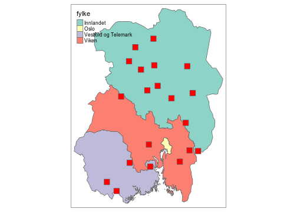


```r

beetle_richness_boot <- bootstrap_value(beetles,
                                        value = no_species,
                                        groups = c("year",
                                                   "region_name")
                                        )
```

This creates an object of type `boot_stat`. Calling it prints a simple summary of the bootstrap values.

```r
beetle_richness_boot
#> # A tibble: 3 × 6
#>    year region_name no_species boot_sd boot_lower2.5 boot_upper97.5
#>   <int> <chr>            <dbl>   <dbl>         <dbl>          <dbl>
#> 1  2020 Østlandet         57.5    7.78          43.2           73.4
#> 2  2021 Østlandet         38.9    4.96          29.5           49.8
#> 3  2021 Trøndelag         20.0    2.21          15.9           24.6
```

But the output is actually a list, that also stores the individual bootstrap values for later computation.


```r
beetle_richness_boot[2]
#> $bootstrap_values
#> # A tibble: 2,997 × 3
#> # Groups:   year, region_name [3]
#>     year region_name boot_values
#>    <int> <chr>             <dbl>
#>  1  2020 Østlandet          61.2
#>  2  2020 Østlandet          67.9
#>  3  2020 Østlandet          56.8
#>  4  2020 Østlandet          62.0
#>  5  2020 Østlandet          53.5
#>  6  2020 Østlandet          49.0
#>  7  2020 Østlandet          55.8
#>  8  2020 Østlandet          66.7
#>  9  2020 Østlandet          60.4
#> 10  2020 Østlandet          53.2
#> # … with 2,987 more rows
```


## Compare bootstrap values to a reference point
In practice, the hardest thing for making indicators will be coming up with good reference points for the measured variables. Putting these difficulties aside for a moment, the next step is to compare the observed values (with bootstrapped uncertainty) to the chosen reference value. This could potentially be made in several ways. Most simply, if we have a single numeric value as a reference point, we can simply subtract that from the observed values. For example, if we observe 13 species of beetles in 2022 at a location, and the reference point is 10, the 2022 has increased by 13 - 10 = 3 species. Such subtractions chould be made on the set of bootstrapped values, before new summary statistics is calculated. The `boot_stat` has its own subtraction method do to just that.


```r
beetle_richness_boot
#> # A tibble: 3 × 6
#>    year region_name no_species boot_sd boot_lower2.5 boot_upper97.5
#>   <int> <chr>            <dbl>   <dbl>         <dbl>          <dbl>
#> 1  2020 Østlandet         57.5    7.78          43.2           73.4
#> 2  2021 Østlandet         38.9    4.96          29.5           49.8
#> 3  2021 Trøndelag         20.0    2.21          15.9           24.6
```


```r
diff_beetle_richness_boot <- beetle_richness_boot - 30
```


```r
diff_beetle_richness_boot
#> # A tibble: 3 × 6
#>    year region_name no_species boot_sd boot_lower2.5 boot_upper97.5
#>   <int> <chr>            <dbl>   <dbl>         <dbl>          <dbl>
#> 1  2020 Østlandet        27.5     7.78          13.2           43.3
#> 2  2021 Østlandet         8.93    4.96          -0.5           19.8
#> 3  2021 Trøndelag        -9.95    2.21         -14.1           -5.4
```

We could also use a reference point in the time series itself. Say for example that we want to use the values for forest i Østlandet 2020 as a reference point. We can then calculate the difference (the contrast) between this level and all the other levels. We do this by the function `boot_contrast()`

NB! This functionality is in development. It currently works for single rows as reference points, but needs updating to allow for referencing several values, e.g using the start values for all regions and habitat types as their own reference points.


```r

diff_beetle_richness_boot2 <- beetle_richness_boot %>%
  boot_contrast(year == 2020 & region_name == 'Østlandet')
```

```r
diff_beetle_richness_boot2
#> # A tibble: 3 × 6
#>    year region_name no_species boot_sd boot_lower2.5 boot_upper97.5
#>   <int> <chr>            <dbl>   <dbl>         <dbl>          <dbl>
#> 1  2020 Østlandet          0      0              0            0    
#> 2  2021 Østlandet        -18.6    9.18         -38           -0.850
#> 3  2021 Trøndelag        -37.5    8.20         -54.2        -21.9
```


## Display and plot bootstrap values
The boot_stat class also has its own plot function. It tries to plot a comparison of the bootstrap distributions over years, for each group. For example, if we plot the object `beetle_richness_boot`, we can look at the yearly differences in beetles species richness in the two geographic regions: (Note that we have only 1 year of data from Trøndelag so far)


```r
plot(beetle_richness_boot)
#> Picking joint bandwidth of 1.44
#> Picking joint bandwidth of 0.489
```

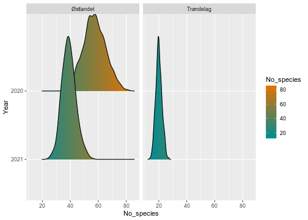

In the cases where we have used a single row as a reference point, this shows up as a sharp spike at 0.


```r
plot(diff_beetle_richness_boot2)
#> Picking joint bandwidth of 1.15
#> Picking joint bandwidth of 1.85
```


For the beetle richness object, we have the data aggregated into two levels, year and region_name. The above plot then uses the year as the main factor, and the other (region_name) as the facet, as seen in the above figures. This automatic faceting works less well when we have more groupings. We can then specify the faceting manually. Here, an example with pollinators aggregated to year, habitat_type, and region_name:


```r
poll_region_habitat_year_boot <- bootstrap_value(poll_region_habitat_year,
                                               value = no_species,
                                               groups = c("year",
                                                          "habitat_type",
                                                          "region_name"))
```

The default plot then uses the first grouping after year as the facet:

```r
plot(poll_region_habitat_year_boot)
#> Picking joint bandwidth of 10.1
#> Picking joint bandwidth of 11.7
```

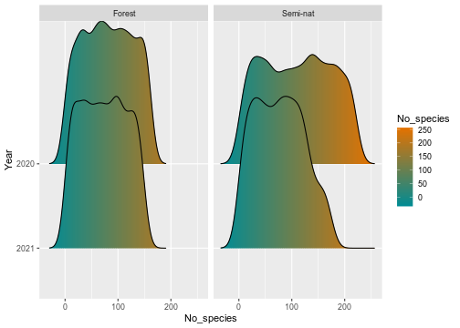
We can override this by manually specifying the facets, for example using the region name:


```r
plot(poll_region_habitat_year_boot) +
  facet_wrap("region_name")
#> Picking joint bandwidth of 10.3
#> Picking joint bandwidth of 8.39
```

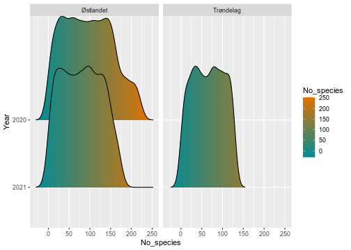
We can further split up the data, by specifying all groupings we wish to use:


```r
plot(poll_region_habitat_year_boot) +
  facet_wrap(c("habitat_type", "region_name"))
#> Picking joint bandwidth of 10.1
#> Picking joint bandwidth of 12.9
#> Picking joint bandwidth of 8.39
```

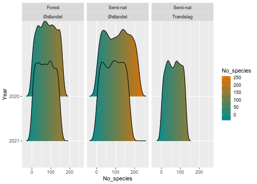


## Map plots
In addition to the density plots above, we can also display the values geographically, in a map. The `map_plot()` function takes a `boot_stat` object and plots the values according to its region names.


```r
map_plot(poll_region_habitat_year_boot)
```

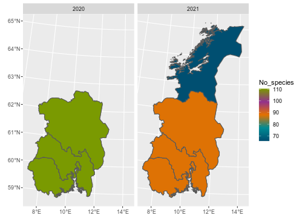

By default, it only shows the regions with data, but this can be overridden manually:

```r
map_plot(diff_beetle_richness_boot,
         whole_country = TRUE)
```

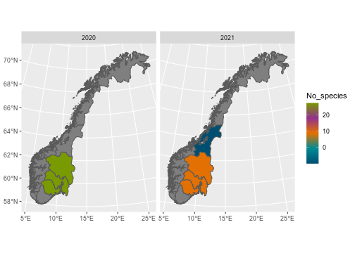

We can also choose a different palette from the NinaR package, and visualize the uncertainty by setting the transparency of the colors from the bootstrap standard deviations. By the way, most of these functions can be piped as well:


```r
diff_beetle_richness_boot %>%
map_plot(palette = "orange-green",
         whole_country = FALSE,
         alpha_from_sd = TRUE)
```

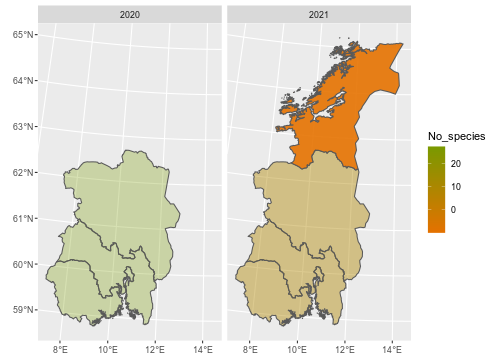

# Worked examples

We can produce a potentially large set of indicators using this generalized workflow, depending on what taxa, habitat type, measurement, and refererence point we choose. These choices must be chosen carefully and evaluated. For now, we show a lists some potential indicators and the required commands to produce them.


<table class="table" style="margin-left: auto; margin-right: auto;">
 <thead>
  <tr>
   <th style="text-align:left;"> Indicator </th>
   <th style="text-align:left;"> Data fetching </th>
   <th style="text-align:left;"> Taxonomic subsetting </th>
   <th style="text-align:left;"> Other subsetting </th>
   <th style="text-align:left;"> Aggregation </th>
   <th style="text-align:left;"> Uncertainty estimation </th>
   <th style="text-align:left;"> Referencing </th>
  </tr>
 </thead>
<tbody>
  <tr>
   <td style="text-align:left;"> Total biomass </td>
   <td style="text-align:left;"> get_biomass() </td>
   <td style="text-align:left;"> None </td>
   <td style="text-align:left;"> None </td>
   <td style="text-align:left;"> year, habitat_type, region </td>
   <td style="text-align:left;"> boostrap_value(weight) </td>
   <td style="text-align:left;"> boot_contrast() </td>
  </tr>
  <tr>
   <td style="text-align:left;"> Total species richness </td>
   <td style="text-align:left;"> get_observations() </td>
   <td style="text-align:left;"> None </td>
   <td style="text-align:left;"> None </td>
   <td style="text-align:left;"> year, habitat_type, region </td>
   <td style="text-align:left;"> bootstrap_value(no_species) </td>
   <td style="text-align:left;"> boot_contrast() </td>
  </tr>
  <tr>
   <td style="text-align:left;"> Number of saproxylic beetles in forest sites </td>
   <td style="text-align:left;"> get_observations() </td>
   <td style="text-align:left;"> Curated list of saproxylic species </td>
   <td style="text-align:left;"> habitat_type == Forest </td>
   <td style="text-align:left;"> year, region </td>
   <td style="text-align:left;"> bootstrap_value(no_species) </td>
   <td style="text-align:left;"> subtract expert opinion reference point </td>
  </tr>
  <tr>
   <td style="text-align:left;"> Shannon diversity of pollinators in semi-natural sites </td>
   <td style="text-align:left;"> get_observations() </td>
   <td style="text-align:left;"> List of pollinator families </td>
   <td style="text-align:left;"> habitat_type == Semi-nat </td>
   <td style="text-align:left;"> year, region </td>
   <td style="text-align:left;"> bootstap_value(shannon_div) </td>
   <td style="text-align:left;"> subtract expert opinion reference point </td>
  </tr>
</tbody>
</table>

## Shannon diversity of pollinators as an example
As an example, we can work through the calculation of a hypothetical indicator of the shannon diversity of insect pollinators on the regional level.

### Data fetching
We begin with fetching the observational data.


```r
pollinators_fam <- get_pollinators() %>%
  select(family_latin) %>%
  pull()

poll_year_locality <- get_observations(subset_families = pollinators_fam,
                                  agg_level = "year_locality",
                                  subset_habitat = "Semi-nat"

                                      )
```


```r
poll_year_locality %>%
  slice(1:5) %>%
  kbl() %>%
  kable_styling()
```

<table class="table" style="margin-left: auto; margin-right: auto;">
 <thead>
  <tr>
   <th style="text-align:right;"> year </th>
   <th style="text-align:left;"> locality </th>
   <th style="text-align:left;"> habitat_type </th>
   <th style="text-align:left;"> region_name </th>
   <th style="text-align:right;"> no_species </th>
   <th style="text-align:right;"> shannon_div </th>
   <th style="text-align:right;"> mean_asv_per_species </th>
  </tr>
 </thead>
<tbody>
  <tr>
   <td style="text-align:right;"> 2020 </td>
   <td style="text-align:left;"> Semi-nat_01 </td>
   <td style="text-align:left;"> Semi-nat </td>
   <td style="text-align:left;"> Østlandet </td>
   <td style="text-align:right;"> 91 </td>
   <td style="text-align:right;"> 4.51 </td>
   <td style="text-align:right;"> 1 </td>
  </tr>
  <tr>
   <td style="text-align:right;"> 2020 </td>
   <td style="text-align:left;"> Semi-nat_02 </td>
   <td style="text-align:left;"> Semi-nat </td>
   <td style="text-align:left;"> Østlandet </td>
   <td style="text-align:right;"> 34 </td>
   <td style="text-align:right;"> 3.53 </td>
   <td style="text-align:right;"> 1 </td>
  </tr>
  <tr>
   <td style="text-align:right;"> 2020 </td>
   <td style="text-align:left;"> Semi-nat_03 </td>
   <td style="text-align:left;"> Semi-nat </td>
   <td style="text-align:left;"> Østlandet </td>
   <td style="text-align:right;"> 41 </td>
   <td style="text-align:right;"> 3.71 </td>
   <td style="text-align:right;"> 1 </td>
  </tr>
  <tr>
   <td style="text-align:right;"> 2020 </td>
   <td style="text-align:left;"> Semi-nat_04 </td>
   <td style="text-align:left;"> Semi-nat </td>
   <td style="text-align:left;"> Østlandet </td>
   <td style="text-align:right;"> 57 </td>
   <td style="text-align:right;"> 4.04 </td>
   <td style="text-align:right;"> 1 </td>
  </tr>
  <tr>
   <td style="text-align:right;"> 2020 </td>
   <td style="text-align:left;"> Semi-nat_05 </td>
   <td style="text-align:left;"> Semi-nat </td>
   <td style="text-align:left;"> Østlandet </td>
   <td style="text-align:right;"> 72 </td>
   <td style="text-align:right;"> 4.28 </td>
   <td style="text-align:right;"> 1 </td>
  </tr>
</tbody>
</table>

## Bootstrapping


```r
poll_shannon_boot <- bootstrap_value(poll_year_locality,
                                     value = shannon_div,
                                     groups = c("year",
                                                "region_name")
)

```


```r
poll_shannon_boot %>%
  print() %>%
  kbl() %>%
  kable_styling()
```


### Comparing to a reference state
For simplicity, let's say that we have an expert opinion based reference value of the Shannon diversity, and that has the value of 4. We can then simply subtract this value to get the difference, and thus the relative value.


```r
poll_shannon_boot_diff <- poll_shannon_boot - 4
```

## Displaying and plotting the indicator values


```r
poll_shannon_boot_diff %>%
  print() %>%
  kbl() %>%
  kable_styling()
```


```r
plot(poll_shannon_boot_diff)
#> Picking joint bandwidth of 0.0236
#> Picking joint bandwidth of 0.0215
```

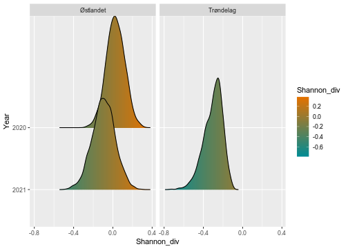

In the map plot, we can show the uncertainty in the estimate as level of transparancy, (in development).


```r
poll_shannon_boot_diff %>%
  map_plot(alpha_from_sd = T)
```

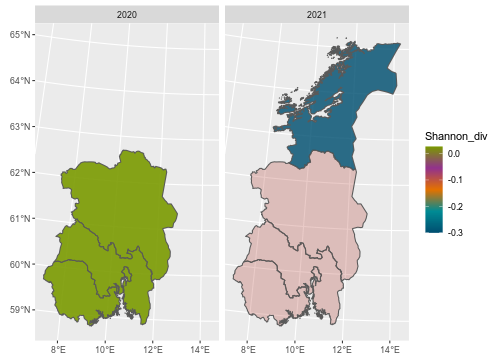


## To-do list
This is still early work, although the basic framework is in place.

For example, we should also implement this:

* What to do with scaling? (see Anders K's examples)
* Fix number of digits in print function of boot_stat objects
* Subsetting functions for map plots (show e.g. only a selected year)
* Plotting uncertainty on maps (perhaps simply allowing to choose a lower or upper bound?)
* Ability to subtract list of reference states. Joining on all levels except year and subtracting?
* Add vertical line at 0 option for plot.boot_stat function (for visualizing difference from 0)
* Add simpler time-series plotting function.
* Add filter functions to boot_stat objects (for easier plotting of specific strata)
* Add time filter on get_observations, to get comparable time windows (but for phenology variation)


